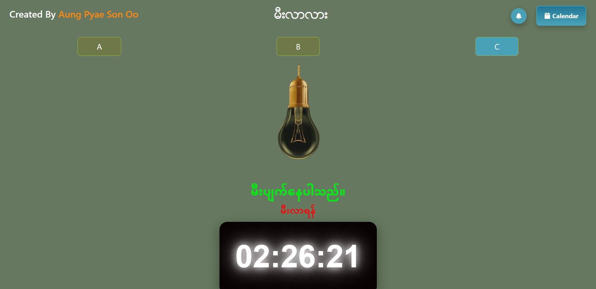

# 📌 မီးလာလား

That project help you,you can know electricity come or not

## 📸 Preview



---

## 📂 Project Structure
```
Mee-Lar-Larr/
|-- node_modules
│-- public/
│-- src/
│   ├── components/  
|   |   ├── buttons/
|   |   |   ├── AButton.jsx
|   |   |   ├── BButton.jsx
|   |   |   ├── CButton.jsx
│   │   ├── ButtonsComponent.jsx
│   │   ├── CalendarPage.jsx
|   |   ├── ClockDisplay.jsx
|   |   ├── HeaderButton.jsx
|   |   ├── HeaderInfoComponent.jsx
|   |   ├── Schedule.jsx
│   ├── photos/
|   |   ├── Bulb_On
|   |   ├── Bulb_Off
│   ├── App.css
│   ├── App.jsx
│   ├── main.jsx
│-- index.html
│-- package-lock.json
│-- package.json
```

---

## 🚀 Installation Guide

1. Clone the repository:
   ```bash
   git clone https://github.com/your-username/project-name.git
   ```
2. Navigate into the project folder:
   ```bash
   cd project-name
   ```
3. Install dependencies:
   ```bash
   npm install
   ```
4. Run the project:
   ```bash
   npm run dev
   ```

---

## 🍴 How to Fork This Project
1. Click the **Fork** button on the top right of this repository.
2. Clone the forked repository:
   ```bash
   git clone https://github.com/AungPyaeSonOo/မီးလာလား.git
   ```
3. Create a new branch for your changes:
   ```bash
   git checkout -b my-new-feature
   ```
4. Make your changes and commit them:
   ```bash
   git commit -m "Added my new feature"
   ```
5. Push the changes to your fork:
   ```bash
   git push origin my-new-feature
   ```
6. Create a **Pull Request**!

---

## 📬 Contact

If you have any questions or suggestions, feel free to reach out:
- **Email:** aungpyaesonoo002@gmail.com
- **GitHub:** [your-username](https://github.com/AungPyaeSonOo)
- **LinkedIn:** [your-profile](https://linkedin.com/in/your-profile)

---

⭐ If you like this project, give it a **star** on GitHub!

